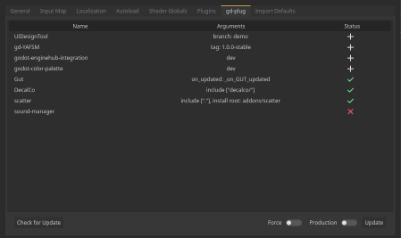
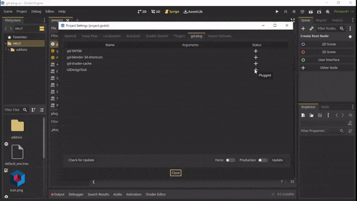
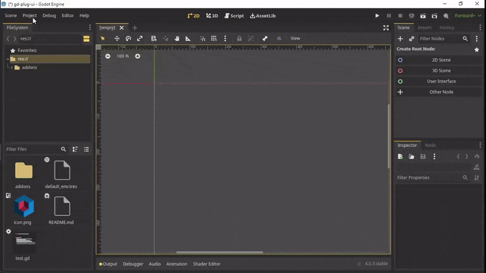

#  gd-plug-ui

User interface for plugin manager [gd-plug](https://github.com/imjp94/gd-plug)

## Installation

Install directly from Godot Asset Library

or

Download this repository, move `addons` to your `{project_dir}`

### Dependency

[gd-plug and git](https://github.com/imjp94/gd-plug#installation)

> Make sure to update gd-plug to at least 0.2.3(godot4) or 0.1.3(godot3)

## Getting Started

1. Open `Project Settings` then navigate to `Plugins` tab.
2. Activate `gd-plug-ui` then navigate to `gd-plug` tab next to `Plugins` tab.
3. Click on `Init` button.
4. Start managing plugins in `plug.gd` at project root, see [Getting Started with gd-plug](https://github.com/imjp94/gd-plug#getting-started)
5. Click on `Update` button in `gd-plug` tab to apply changes.

